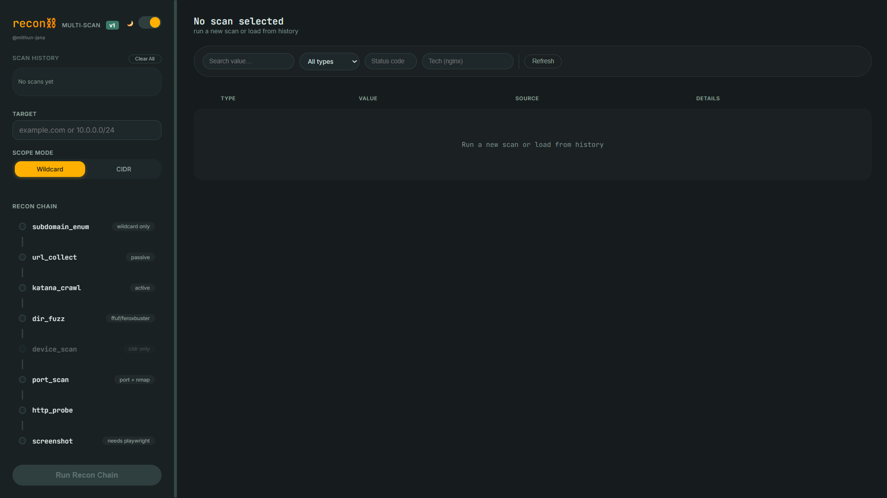
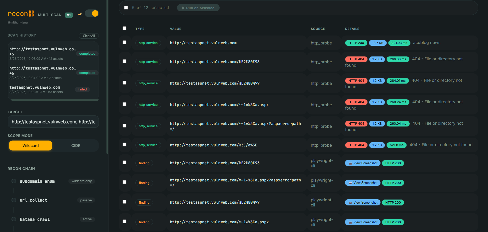
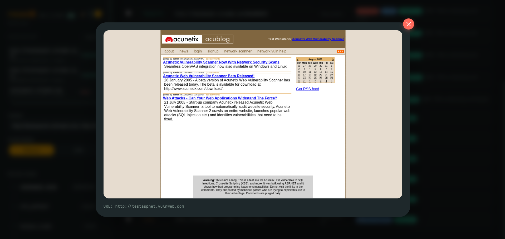

<div align="center">

# recon-chain
**🔍 Multi-stage reconnaissance chain**

[](https://opensource.org/licenses/MIT)
[](https://www.python.org/downloads/)
[](https://hub.docker.com/r/mithunjana/recon-chain)
[](https://hub.docker.com/r/mithunjana/recon-chain)

> **One container. Full reconnaissance pipeline. No setup.**  
 Deploy a complete multi-stage recon tool with web UI in under 60 seconds.

This tool automates the **reconnaissance / discovery phase only** — no exploitation, no vulnerability scanning. Only run it against targets you own or have explicit written authorization to test. You are responsible for how you use it.

</div>

## Quick start (Docker — recommended)

Pull the pre-built image straight from Docker Hub — no need to clone the repo or build anything:
```bash
# API docs at `http://localhost:8000/docs`
docker pull mithunjana/recon-chain:latest

docker run -d --name recon-chain -p 8000:8000 -p 8080:8080 -v recon_data:/app/data --cap-add NET_RAW mithunjana/recon-chain:latest
```
Windows-Specific Notes
WSL2 Required: Docker Desktop on Windows uses WSL2 by default. Make sure WSL2 is installed
```bash
# Run in PowerShell as Administrator
wsl --install
```
## 📸 Screenshots

### Interface

### scan

### screenshot

---
##  Features

- **Multi-Stage Recon Pipeline** — 9 interconnected stages from subdomain enumeration to screenshotting, all automated
- **Real-Time Asset Streaming** — Discovered assets appear instantly in the UI as scans progress
- **Parallel Scan Support** — Run multiple scans concurrently with full isolation
- **Flexible Scope Modes** — Wildcard subdomain, CIDR blocks
- **Multi-Target Support** — Scan comma-separated targets in a single run
- **Concurrency & rate control for dir-fuzz** — tunable request concurrency and rate limit so fuzzing stays safe against production-grade servers instead of hammering them (backend config: `max_concurrency`, `rate_limit_per_sec` in `ScanConfig`)
- **Smart Tool Fallbacks** — Every CLI tool is optional; pure-Python implementations ensure it always works
- **Web UI with React** — Clean, dark-mode-ready interface with filtering, search, and bulk operations
- **Export Results** — Export discovered assets as JSON or CSV
- **Custom Wordlists** — Upload your own wordlists for directory fuzzing
- **Screenshot Management** — Full-page screenshots stored and viewable in the UI
- **Docker Ready** — Single container with all dependencies, tools, and frontend included
- **Data Persistence** — Scans, assets, screenshots, and wordlists survive container restarts

---

### Building from source instead

If you'd rather build it yourself from this repo:

```bash
git clone https://github.com/mithun-jana/recon-chain.git
cd recon-chain
docker compose up --build
```
### What's inside the image

| Tool | Purpose |
|---|---|
| subfinder, httpx, dnsx | subdomain enum / HTTP probing |
| naabu, nmap | port scanning + service enrichment |
| katana | crawling |
| ffuf, feroxbuster | directory fuzzing |
| gau | passive URL collection |
| Playwright + Chromium | screenshots |

All optional — each falls back to a Python equivalent if the binary is missing.

### Troubleshooting

| Problem | Fix |
|---|---|
| Build fails on `playwright install --with-deps chromium` | Needs internet during build — check network/proxy |
| "Could not reach the API" | Confirm port 8000 is published; check `docker logs recon-chain` |
---

### Native install in linux

```bash
chmod +x setup-recon-chain.sh
./setup-recon-chain.sh
```

Installs system packages, the Go toolchain, all recon CLI tools, raw-socket capabilities, the Python backend environment, and Playwright/Chromium. Safe to re-run — already-installed tools are skipped automatically.

```bash
./setup-recon-chain.sh --force   # reinstall/upgrade everything anyway
```

After it runs, add this to `~/.bashrc` (Go tools are only on `PATH` for that script's own session otherwise):

```bash
export PATH=$PATH:/usr/local/go/bin:$HOME/go/bin
```

### Run the backend

```bash
cd backend
source .venv/bin/activate
uvicorn app.main:app --host 0.0.0.0 --port 8000
```

### Serve the frontend

```bash
cd frontend
python3 -m http.server 8080
```

Open **http://localhost:8080** — it auto-detects the backend at `<same-host>:8000`.

## Project structure

```
recon-chain/
├── backend/
│   ├── app/
│   │   ├── main.py           # FastAPI routes
│   │   ├── orchestrator.py   # stage chaining / scan lifecycle
│   │   ├── scope.py          # scope enforcement — read this first
│   │   ├── models.py         # DB models / enums
│   │   └── tools/            # one module per recon stage
│   ├── wordlists/
│   └── requirements.txt
├── frontend/
│   └── index.html            # single-file React UI, no build step
├── docker/
│   └── entrypoint.sh
├── Dockerfile
├── docker-compose.yml
└── setup-recon-chain.sh      # native Linux installer
```
## Contributing

Issues and PRs welcome. Please open an issue describing the change before submitting a large PR.

## Author

**@mithun-jana**

<div align="center">

⭐ **If this saved you time, drop a star!** ⭐

</div>
